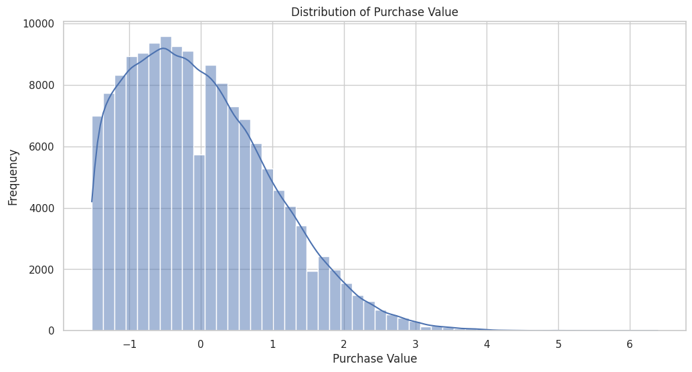
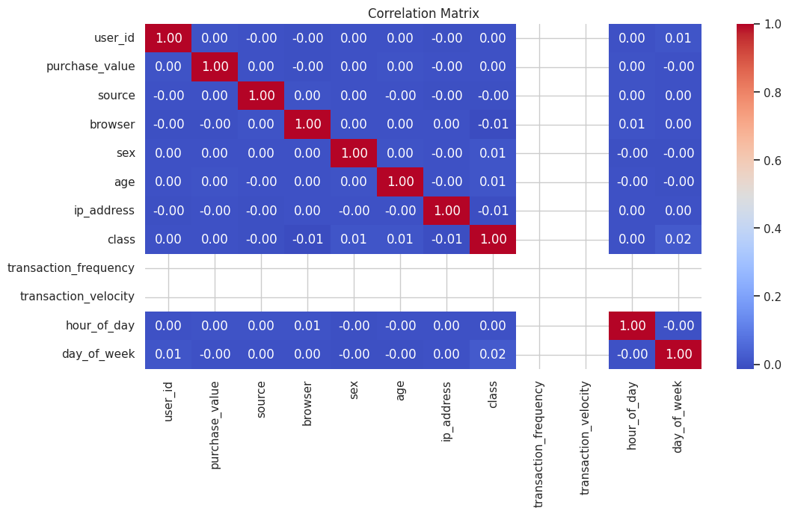

# AI-Fraud-Detection-e-commerce-and-bank-transactions

## Overview
This project aims to detect fraudulent activities in e-commerce and bank transactions using machine learning techniques. The datasets include e-commerce transaction data and bank transaction data specifically curated for fraud detection analysis.

## Datasets
### Fraud_Data.csv
Includes e-commerce transaction data aimed at identifying fraudulent activities.

- `user_id`: A unique identifier for the user who made the transaction.
- `signup_time`: The timestamp when the user signed up.
- `purchase_time`: The timestamp when the purchase was made.
- `purchase_value`: The value of the purchase in dollars.
- `device_id`: A unique identifier for the device used to make the transaction.
- `source`: The source through which the user came to the site (e.g., SEO, Ads).
- `browser`: The browser used to make the transaction (e.g., Chrome, Safari).
- `sex`: The gender of the user (M for male, F for female).
- `age`: The age of the user.
- `ip_address`: The IP address from which the transaction was made.
- `class`: The target variable where 1 indicates a fraudulent transaction and 0 indicates a non-fraudulent transaction.

### IpAddress_to_Country.csv
Maps IP addresses to countries.

- `lower_bound_ip_address`: The lower bound of the IP address range.
- `upper_bound_ip_address`: The upper bound of the IP address range.
- `country`: The country corresponding to the IP address range.

### creditcard.csv
Contains bank transaction data specifically curated for fraud detection analysis.

- `Time`: The number of seconds elapsed between this transaction and the first transaction in the dataset.
- `V1` to `V28`: These are anonymized features resulting from a PCA transformation. Their exact nature is not disclosed for privacy reasons, but they represent the underlying patterns in the data.
- `Amount`: The transaction amount in dollars.
- `Class`: The target variable where 1 indicates a fraudulent transaction and 0 indicates a non-fraudulent transaction.

## Data Analysis and Preprocessing

### 1. Handle Missing Values
- Impute or drop missing values.

### 2. Data Cleaning
- Remove duplicates.
- Correct data types.

### 3. Exploratory Data Analysis (EDA)
- Univariate analysis.
- Bivariate analysis.

### 4. Merge Datasets for Geolocation Analysis
- Convert IP addresses to integer format.
- Merge `Fraud_Data.csv` with `IpAddress_to_Country.csv`.

### 5. Feature Engineering
- Transaction frequency and velocity for `Fraud_Data.csv`.
- Time-Based features for `Fraud_Data.csv`:
    - `hour_of_day`
    - `day_of_week`

### 6. Normalization and Scaling
- Normalize and scale numerical features.

### 7. Encode Categorical Features
- Encode categorical features using label encoding.

## Visualizations
### Distribution of Purchase Value

### Correlation Matrix

## How to Run
Setup Instructions

    Clone the Repository

git clone https://github.com/duresaguye/AI-Fraud-Detection
cd AI-Fraud-Detection

Install Dependencies
Ensure all required dependencies are installed:

pip install -r requirements.txt

Run Data Preprocessing
Execute the Jupyter notebook to preprocess the data and generate visualizations:

    Open the notebooks folder.
    Run Data_Preprocessing_with_Scikit_Learn.ipynb in Jupyter Notebook.
